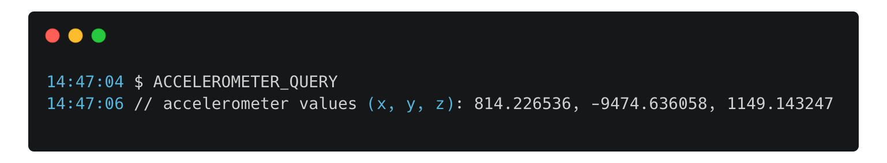
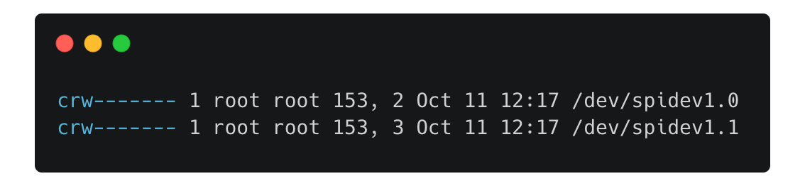
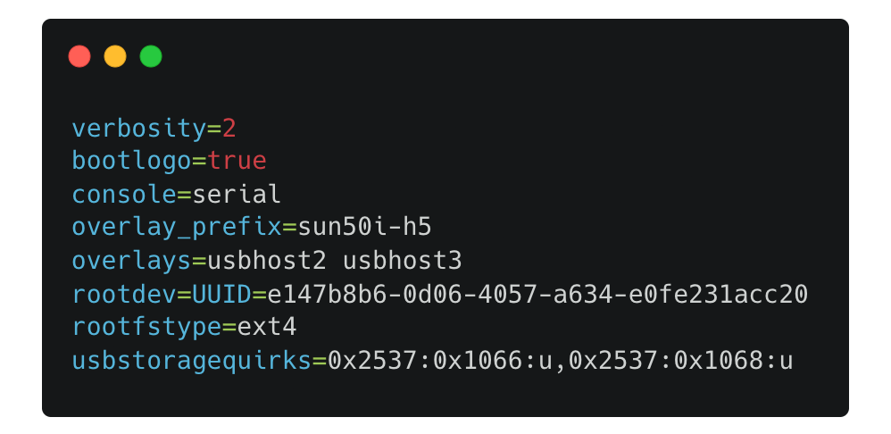
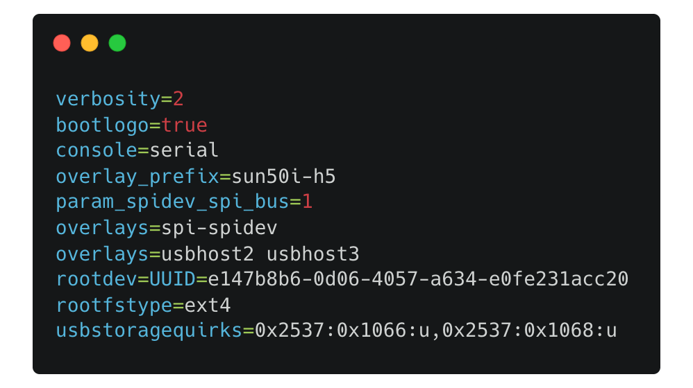
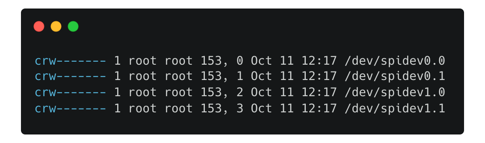

### ADXL via SPI

In some cases the ADXL via SPI won't work out of the box. We'll fix that :)


1. First let's configure the adxl in config files. Edit `printer.cfg` and add the following:

```
[adxl345]
cs_pin: host:None

[resonance_tester]
accel_chip: adxl345
probe_points: 60, 60, 20
```

2. Run `ACCELEROMETER_QUERY` in the fluidd/mainsail console to check if everything's working. The correct output look lke this:



If you're getting any errors, try running the command again as soon as possible if the problem persists there's a set of things that we can do.

3. Let's check what SPI address are available by running `ls -la /dev/spi*`



4. Update the `[adxl345]` config part by adding the `spi_bus: spidevX.X` according to the list you get from previous step and rerun `ACCELEROMETER_QUERY` command again:
> **Replace the X.X with number you got from the `ls` command**
```
[adxl345]
cs_pin: host:None
spi_bus: spidev1.0 # or spidev1.1
```

If you're still getting errors we need to edit the host OS file `/boot/armbianEnv.txt` and add spi-spidev overlay.
>For some strange reason using `armbian-config` doesn't seems to work. (You can try, though)

5. Edit the armbinaEnv file by running

```
nano /boot/armbianEnv.txt
```

The file should look similar to like the one below.



We need to add two things just below the line that starts with phrase `overlays`

```
param_spidev_spi_bus=1
overlays=spi-spidev
```

The final file should look like this



> Why I didn't put the file for you to copy? :) Because it can very from board to board, so it's better to just paste the lines in correct place. Don't be lazy!

6. Redo the point 3 - you should get additional spi devices on the list



7. Redo the point 4. If everything went ok, you should be able to successfully check accelerometer status (look point 2)

### Camera
Look in crowsnest logs for something like video0 / video1
Change your crowsnest.conf to match the camera that has been detected as a camera

I've uploaded the macros that came on the board I recieved, use the printer cfg included in this repository as an example of where to put the config

> **REMEMBER TO RUN ENDSTOP CALIBRATION AND PID TUNING FOR YOUR MACHINE**

API key location in Fluidd for Cura/Octoprint connection


